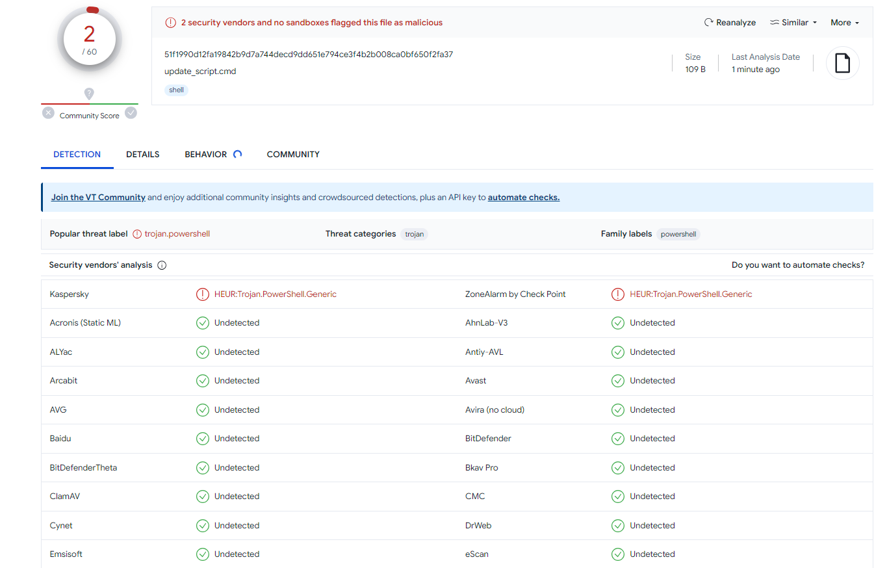
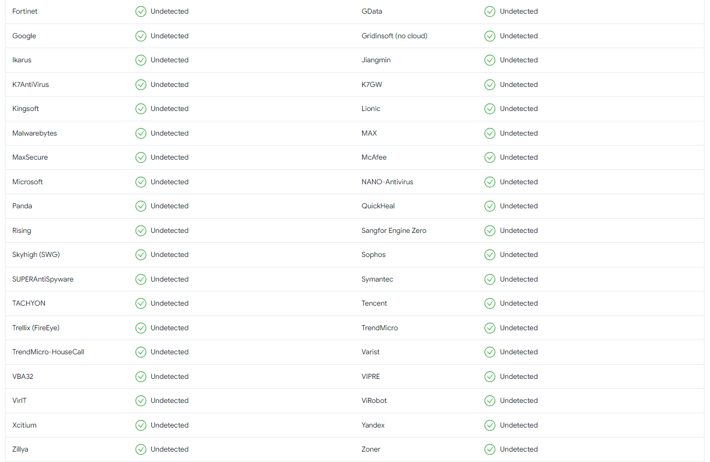

# Results

Interestingly, the update_script file (which happens to be the only file that is used in this 'fileless' reverse shell attack) was only flagged as malicious by 2 security vendors. I did observe that Microsoft Defender SmartScreen did identify the file as a threat when sent over email, which is why I created a download link that would be attached to the phishing email. However, even in this case, the user would have to manually recognise that the file should 'Run Anyway' since it is flagged as suspicious on download (but not as a virus). I imagined that on the basis that there are users who are able to fall for a Nigerian Prince scam, it would not be hard to convince users to run the file despite it being flagged as suspicious.

